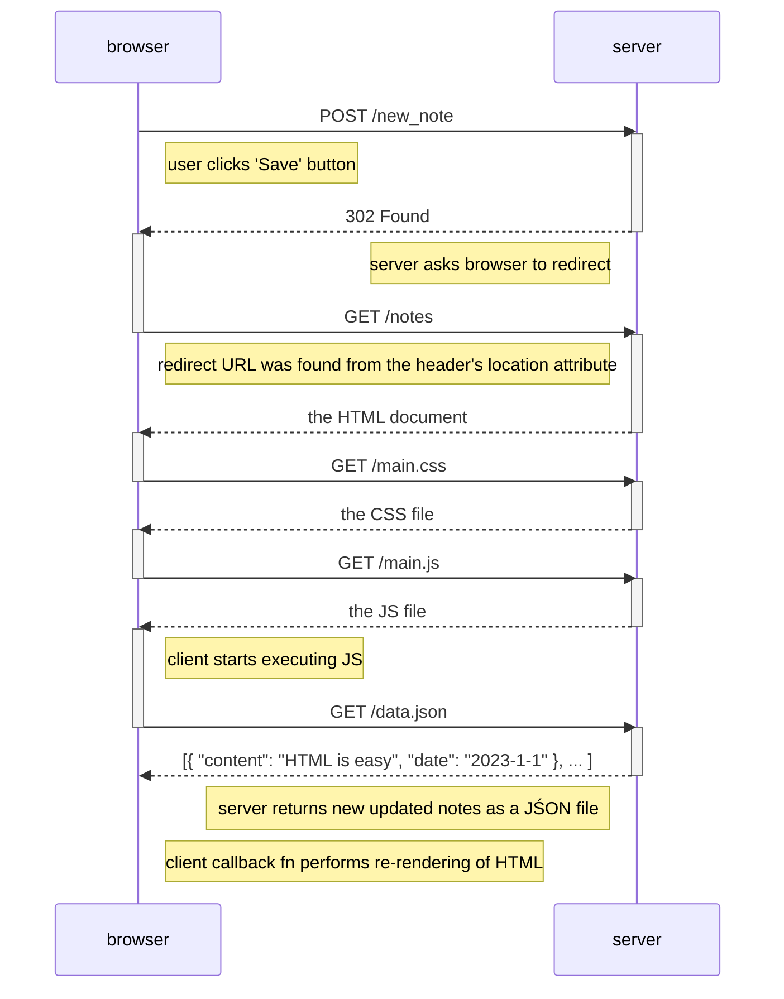

# User Creating a New Note

```mermaid
sequenceDiagram
participant browser
participant server

    browser->>server: POST /new_note
    activate server

    Note right of browser: user clicks 'Save' button

    server-->>browser: 302 Found
    deactivate server
    activate browser

    Note left of server: server asks browser to redirect

    browser->>server: GET /notes
    deactivate browser
    activate server

    Note right of browser: redirect URL was found from the header's location attribute

    server-->>browser: the HTML document
    deactivate server
    activate browser

    browser->>server: GET /main.css
    deactivate browser
    activate server
    server-->>browser: the CSS file
    deactivate server
    activate browser

    browser->>server: GET /main.js
    deactivate browser
    activate server
    server-->>browser: the JS file
    deactivate server
    activate browser

    Note right of browser: client starts executing JS

    browser->>server: GET /data.json
    deactivate browser
    activate server
    server-->>browser: [{ "content": "HTML is easy", "date": "2023-1-1" }, ... ]
    deactivate server

    Note left of server: server returns new updated notes as a JŚON file
    Note right of browser: client callback fn performs re-rendering of HTML
```
