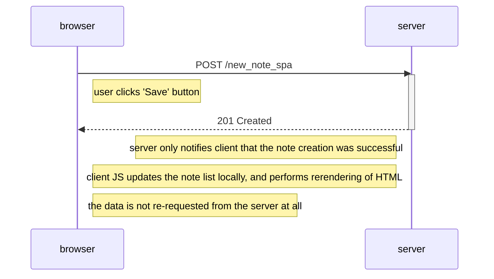

# User Creating a New Note In SPA

```mermaid
sequenceDiagram
participant browser
participant server

    browser->>server: POST /new_note_spa
    activate server

    Note right of browser: user clicks 'Save' button

    server-->>browser: 201 Created
    deactivate server
    activate browser

    Note left of server: server only notifies client that the note creation was successful

    Note right of browser: client JS updates the note list locally, and performs rerendering of HTML

    Note right of browser: the data is not re-requested from the server at all
```
